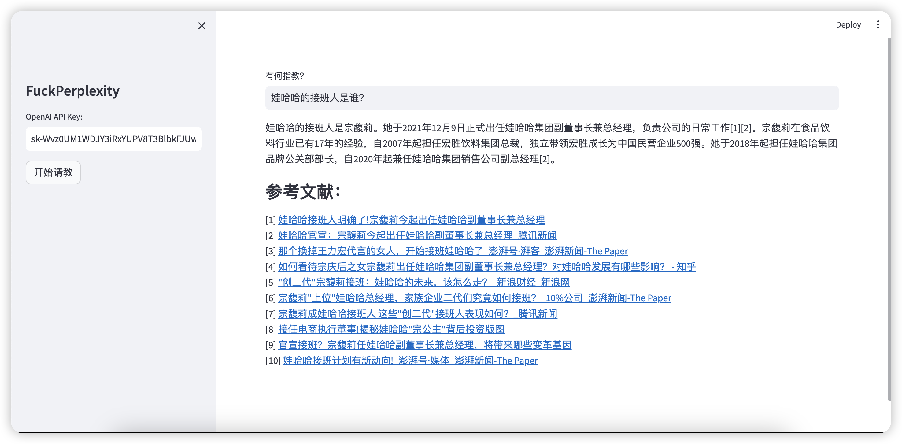

# FuckPerplexity

[Permlexity](https://www.perplexity.ai/)代表下一代搜索引擎，它使用人工智能来理解人类语言，并将可搜索的网页提炼、总结，而**FuckPerplexity**则是[Permlexity](https://www.perplexity.ai/)一个简单的替代品。



## 工作流程

1. 将**question**送入*duckduckgo*搜索实时网页结果；
2. 使用*jina.ai*将网页解析成markdown；
3. 将quesiton、markdown拼成prompt，送入*openai chatgpt*处理；
4. 用*streamlit*将*openai chatgpt*的回答展示到前端。

## 环境准备

```
1. 可科学上网环境
1. pip install -r requirements.txt
```

## 快速开始

```
1. streamlit run webui.py
2. 左侧填写Open AI API Key，右侧填写问题
3. 点击左侧“开始请教”
4. 等待结束
```


## TODO

1. 增加本地LLM支持
